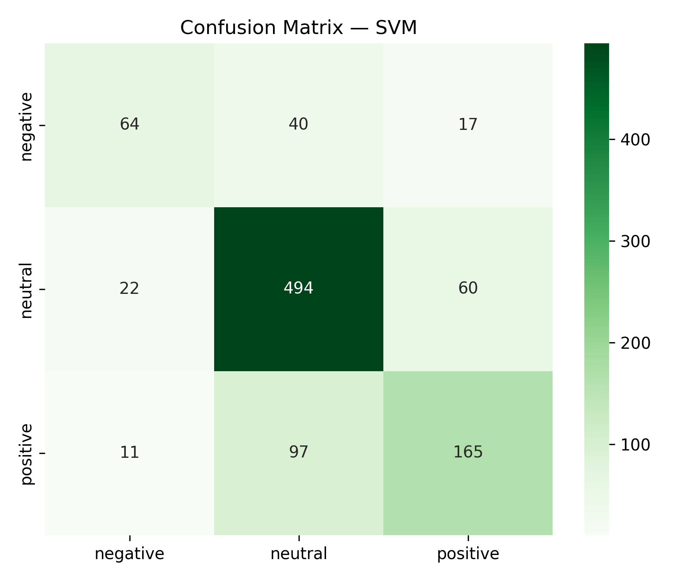

# 📈 Stock Market Sentiment Predictor

A modular, production-ready NLP pipeline for analyzing **financial news sentiment** using **TF‑IDF** and a **Linear SVM classifier**.  
Built with professional software engineering standards: clean architecture, reproducible pipelines, and a Streamlit deployment interface.

---

## 🚀 Project Overview

This project predicts whether a financial news headline expresses **positive**, **neutral**, or **negative** sentiment.

It uses:

- **NLP preprocessing** (cleaning, stopwords, regex)
- **TF‑IDF feature extraction**
- **Linear SVM (best ML model for sparse text data)**
- **Modular pipeline inside `src/`**
- **Streamlit app for real‑time predictions**
- **Full automation via `src/main.py`**

---

## 🧠 Key Features

- End‑to‑end ML pipeline
- Industry‑grade preprocessing
- 5000‑feature TF‑IDF vectorization
- Consistent ~75% accuracy on imbalanced dataset
- Saved artifacts: model, vectorizer, label encoder
- Ready for deployment (local or cloud)

---

## 📁 Project Structure

```
Stock-Sentiment-Predictor/
│
├── app.py                        # Streamlit UI
├── requirements.txt
├── README.md
│
├── data/
│   └── raw/
│       └── all-data.csv          # Kaggle dataset
│
├── models/
│   ├── svm_sentiment_model.pkl
│   ├── tfidf_vectorizer.pkl
│   └── label_encoder.pkl
│
├── assets/
│   └── visuals/
│       └── confusion_matrix_svm_pipeline.png
│
└── src/
    ├── main.py
    ├── data_ingestion.py
    ├── data_preprocessing.py
    ├── feature_engineering.py
    ├── model_training.py
    ├── evaluation.py
    └── utils.py
```

---

## 🧹 Data Cleaning & NLP Preprocessing

✔ Convert to lowercase  
✔ Remove punctuation + special characters  
✔ Remove stopwords  
✔ Normalize whitespace  
✔ Regex‑based filtering  
✔ New column: **clean_sentence**

This produces inputs suitable for vectorization & ML modeling.

---

## 🔡 Feature Extraction: TF‑IDF

- `max_features=5000`
- `ngram_range=(1,2)` → unigrams + bigrams
- English stopwords removed

Final shape:

```
(4846 samples, 5000 features)
```

---

## 🤖 Model Training (Linear SVM)

Trained using stratified split:

```
Train: 80%
Test: 20%
```

**Best Model** → `LinearSVC()`

Reason:  
SVM consistently outperforms Logistic Regression on sparse TF‑IDF embeddings.

---

## 📊 Model Performance

### **Overall Accuracy:** **74.54%**

| Class    | Precision | Recall | F1-score |
| -------- | --------- | ------ | -------- |
| Negative | 0.66      | 0.53   | 0.59     |
| Neutral  | 0.78      | 0.86   | 0.82     |
| Positive | 0.68      | 0.60   | 0.64     |

### 🧩 Confusion Matrix



---

## 🖥️ Streamlit App

Run the app locally:

```
streamlit run app.py
```

Features:

- Input a financial news headline
- Real‑time sentiment prediction
- Color‑coded feedback
- Uses saved SVM + TF‑IDF artifacts

---

## ⚙️ Automation: Full Pipeline

Run the complete ML workflow:

```
python src/main.py
```

This script:

1. Loads dataset
2. Cleans text
3. Extracts TF‑IDF features
4. Trains SVM model
5. Saves confusion matrix
6. Saves model, vectorizer, encoder

---

## 📦 Installation

Create & activate virtual environment:

```
python -m venv .venv
.venv\Scripts\activate       # Windows
```

Install dependencies:

```
pip install -r requirements.txt
```

---

## 📚 Dataset

**Financial News Sentiment Dataset**  
From Kaggle: Financial PhraseBank / all-data.csv

Labels:

- `positive`
- `neutral`
- `negative`

---

## 🧰 Tech Stack

- Python 3.13
- Scikit‑learn
- NLTK
- Streamlit
- Pandas / NumPy

---

## 👨‍💻 Author

**Berke Arda Türk**  
Data Science & AI Enthusiast | Computer Science (B.ASc)  
[🌐 Portfolio Website](https://berke-turk.web.app/) • [💼 LinkedIn](https://www.linkedin.com/in/berke-arda-turk/) • [🐙 GitHub](https://github.com/Mood07)
